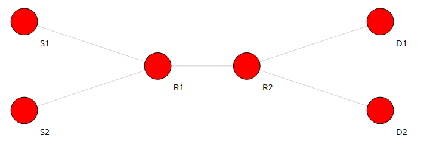
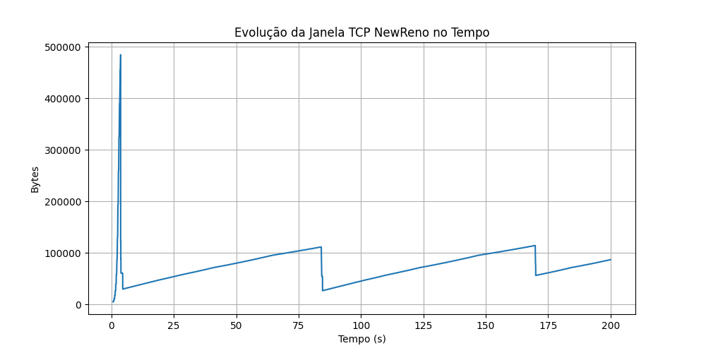
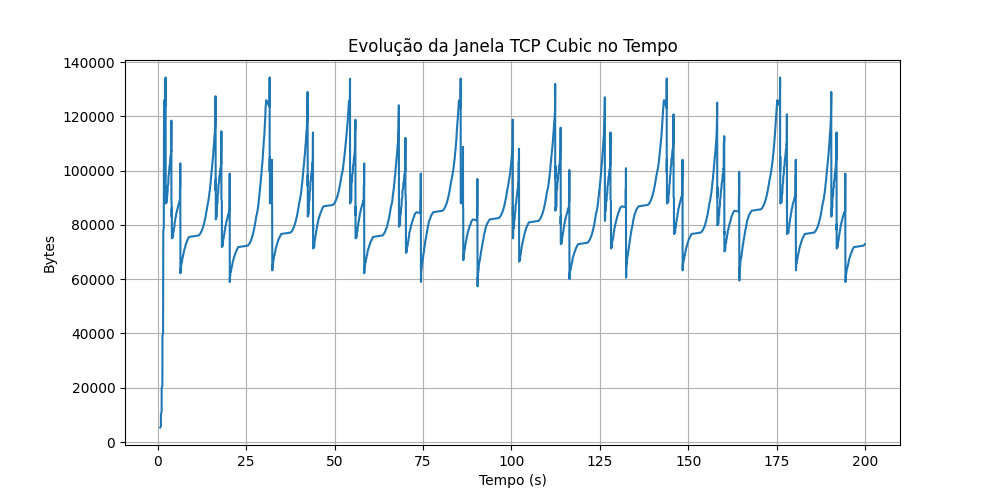
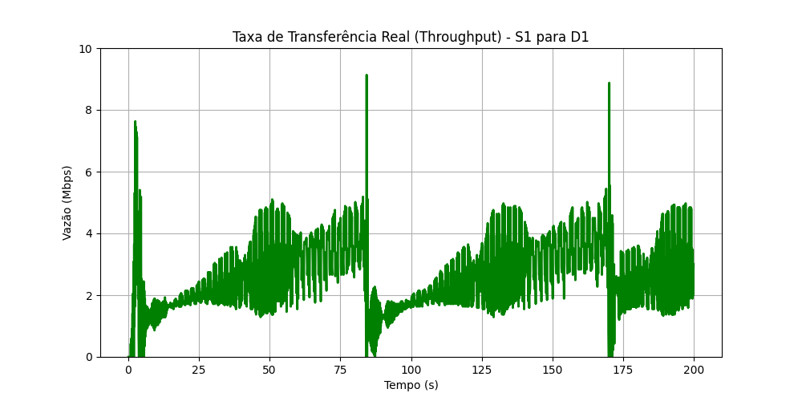
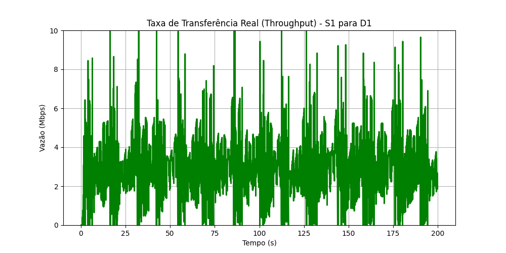

# Relatório Dumbbell TCP Reno Cubic: Comparação Cubic vs. NewReno

**Disciplina:** Redes de Computadores  
**Grupo:** Caio Ferreira \<cfgs\> e Gabriel Monteiro \<gms2\>  
**Ferramenta de Simulação:** ns-3.47

---

## 1. Introdução

Este relatório apresenta uma análise comparativa detalhada do comportamento e desempenho de dois dos algoritmos de controle de congestionamento mais utilizados na história da Internet: **TCP NewReno** e **TCP Cubic**.

O objetivo é observar como cada variante reage em um cenário de rede saturada (gargalo) que concorrem com tráfego de fundo não-responsivo (UDP). A análise foca em duas métricas principais: a Janela de Congestionamento (CWND) e a Taxa de Transferência Real (Throughput).

---

## 2. Metodologia e Cenário Experimental

Para a realização dos testes, foi utilizada uma topologia *Dumbbell* (haltere) simulada no **ns-3**, conforme descrito no documento [Dumbbell-TCP-Reno-Cubic.pdf](./Dumbbell-TCP-Reno-Cubic.pdf).

### 2.1 Configuração da Topologia

A rede foi montada com os seguintes parâmetros:

* **Links de Acesso ($S_n$ para $R_1$ / $R_2$ para $D_n$):** Banda de **10 Mbps** e atraso de **40 ms**.  
* **Link Gargalo ($R_1$ para $R_2$):** Banda de **10 Mbps** e atraso de **20 ms**.  
* **RTT Total:** $\approx (40 + 20 + 40) \times 2 = \mathbf{200 \text{ ms}}$.  
* **Buffer do Gargalo:** Limitado para forçar perdas de pacotes quando a banda exceder 10 Mbps.

### 2.2 Cenário de Tráfego
A simulação teve duração de 200 segundos com os seguintes fluxos de dados:

1. **Fluxo Congestionante (UDP):** Iniciado no tempo `0.0s`, enviando tráfego constante de **8 Mbps** de $S_2$ para $D_2$. Este tráfego não reduz a velocidade em caso de congestionamento.  
1. **Fluxo de Teste (TCP):** Iniciado no tempo `0.5s` (para garantir que a rede já esteja congestionada), transferindo um arquivo grande de $S_1$ para $D_1$.

> **O Desafio:** O link central tem 10 Mbps totais. Como o UDP ocupa 8 Mbps fixos, restam apenas **2 Mbps** para o TCP lutar por eles.

Foram realizadas duas execuções idênticas, alterando apenas o algoritmo do fluxo TCP entre NewReno e Cubic.

---

## 3. Análise da Janela de Congestionamento (CWND)

A Janela de Congestionamento determina a quantidade de dados que o transmissor pode enviar para a rede sem receber uma confirmação (ACK). É o principal indicador de como o TCP "sente" a capacidade da rede.

### 3.1 Resultados Visuais (CWND)

Abaixo estão os gráficos gerados a partir dos arquivos brutos [dados_cwnd_NewReno.txt](./dados_cwnd_NewReno.txt) e [dados_cwnd_Cubic.txt](./dados_cwnd_Cubic.txt).

| TCP NewReno (Sawtooth Clássico) |
| :---: |
|  |

| TCP Cubic (Crescimento Cúbico) |
| :---: |
|  |

### 3.2 Comentários e Diferenças nos Resultados

Ambos os gráficos mostram o comportamento de "dente de serra", característico do mecanismo de detecção de perdas do TCP: a janela cresce até ocorrer uma perda (congestionamento no roteador $R_1$) e cai drasticamente para aliviar a rede.

No entanto, as diferenças na fase de **Crescimento (Congestion Avoidance)** são evidentes:

* **TCP NewReno:** Apresenta um crescimento **estritamente linear** (uma linha reta subindo) após cada queda. Ele aumenta a janela em 1 segmento a cada RTT (Tempo de Ida e Volta). Com um RTT alto de 200ms, esse crescimento é lento.
* **TCP Cubic:** Apresenta uma curva de crescimento **côncava** (em formato de S). Após a queda, ele cresce muito rápido inicialmente para tentar recuperar o nível de utilização anterior e, à medida que se aproxima do ponto de saturação conhecido ($W_{max}$), ele desacelera o crescimento para evitar perdas imediatas. Se nada acontecer, ele volta a acelerar agressivamente.

### 3.3 Razões para o Desempenho da CWND

* **RTT Indiferença do Cubic:** A principal razão para a forma do gráfico do Cubic é que sua função de crescimento depende do **tempo decorrido desde a última perda**, e não diretamente do RTT. Em redes com RTT alto (como os 200ms deste teste), o Reno demora muito para subir, enquanto o Cubic usa sua fórmula cúbica ($\Delta = C(t-K)^3 + W_{max}$) para saltar de volta para perto da banda cheia rapidamente.
* **AIMD do Reno:** O NewReno usa o algoritmo clássico AIMD (Additive Increase Multiplicative Decrease). Ele reduz a janela pela metade na perda e soma 1 pacote por RTT. Essa simplicidade o torna muito lento em redes modernas de alta velocidade ou longa distância.

---

## 4. Análise da Taxa de Transferência Real (Throughput)

A Vazão (Throughput) é o resultado prático: quantos dados úteis chegaram ao destino por segundo. É influenciada diretamente pela estabilidade da CWND.

### 4.1 Resultados Visuais (Vazão no Tempo)

Abaixo estão os gráficos gerados a partir dos arquivos brutos [dados_vazao_NewReno.txt](./dados_vazao_NewReno.txt) e [dados_vazao_Cubic.txt](./dados_vazao_Cubic.txt).

| TCP NewReno |
| :---: |
|  |

| TCP Cubic |
| :---: |
|  |

### 4.2 Comentários e Diferenças nos Resultados

Lembrando que a "banda livre" restante para o TCP era de aproximadamente **2 Mbps** (10 total - 8 UDP).

* **A Briga com o UDP:** Ambos os algoritmos sofrem muito. Como o UDP não tem controle de congestionamento, ele satura a fila do roteador. O TCP envia dados, a fila enche, e o TCP perde pacotes, caindo a velocidade. O UDP continua enviando 8 Mbps inabalavelmente.
* **TCP NewReno:** O gráfico mostra oscilações profundas. A vazão cai frequentemente para perto de 1 Mbps ou menos e demora muito tempo para subir de volta perto dos 2 Mbps. Há muitos "vales" longos de baixa vazão.
* **TCP Cubic:** O Cubic consegue manter a vazão média mais próxima da linha dos 2 Mbps de forma mais consistente. As quedas ocorrem (pois há perdas forçadas pelo UDP), mas o Cubic recupera a taxa de transferência para perto do limite muito mais rápido que o Reno. O gráfico é visivelmente mais "preenchido" na zona de 1.5 a 2.0 Mbps.

### 4.3 Razões para o Desempenho da Vazão

* **Velocidade de Recuperação:** Após uma perda forçada pela saturação da fila (causada pelo UDP), o NewReno volta a crescer linearmente devagar. Enquanto o Reno está "andando", o Cubic está "correndo" de volta para os 2 Mbps utilizando sua curva côncava de crescimento.
* **Utilização do Link:** Devido ao seu crescimento cúbico, o Cubic passa mais tempo operando perto da capacidade máxima disponível do gargalo do que o Reno. Em um cenário com RTT de 200ms, o Reno falha em preencher os 2 Mbps restantes rapidamente após cada evento de descarte de pacote.

---

## 5. Conclusão e Discussão

Este experimento prático no ns-3 demonstrou as vantagens arquiteturais do **TCP Cubic** sobre o **TCP NewReno**, especialmente em cenários com RTT moderado/alto e forte concorrência com tráfego não-responsivo.

### Resumo Comparativo
* **NewReno** é muito lento para recuperar a banda após perdas em redes com RTT alto, devido ao seu crescimento linear AIMD. Isso resulta em baixa vazão média e subutilização do link disponível.
* **Cubic** resolve esse problema tornando o crescimento da janela independente do RTT e utilizando uma função cúbica que acelera a recuperação de banda. Isso resulta em uma vazão mais estável e uma melhor utilização dos recursos da rede.
